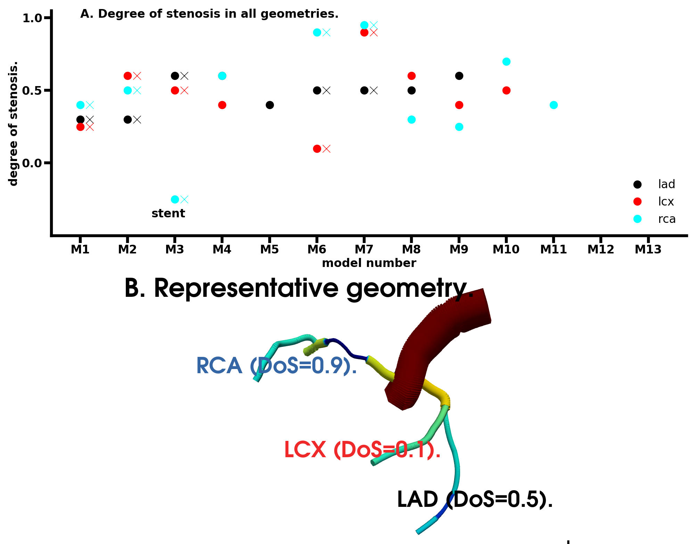
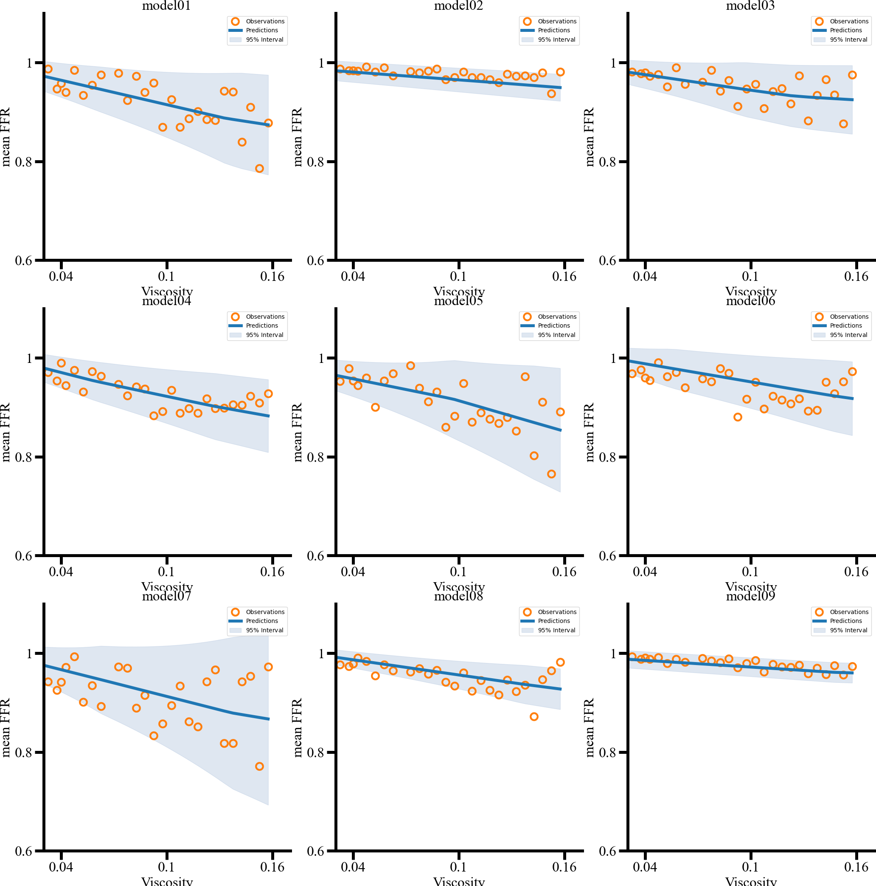

# Repository.  

PM3-SimVascular codes: human coronary fractional flow reserve.

# Background. 

This repo. illustrates the use of a sophisticated platform, SimVascular (https://simvascular.github.io), 
and development of modules/user functions to provide users with a working code.  

The purpose of the clinical CT imaging is to provide the radiologist/CFD modeller an assessment of the suspected coronary
stenosis severity. The radiologist presently assesses the severity by visual inspection and established image driven metrics.
In general, the radiologist classifies the coronary stenosis as severe in cases when the constriction (stenosis) is more than
50% of the known normal diameter value of the concerned vessel. However, the simple assessment is known to lead to
misdiagnosis culminating in patients receiving unnecessary high risk treatment.CFD/FSI modelling may improve 
the diagnostics. However, current CFD modelling is a cost burden to Canadian, UK, and EU healthcare systems with a
price tag of approx. GBP1200 for every patient exam, which still requires 1 to 2 days for the report to become available.

In this proprietary repo, computational estimation of a clinical metric called coronary fractional flow reserve (FFR) is provided.
The starting point is clinical quality myocardial CT imaging. The images are processed, geometries constructed,
a one-dimensional finite element based CFD simulation performed, and simulation output post-processed to provide the FFR estimate. Since the FFR estimate is driven by CT imaging, it is also often called FFR(CT) in the wider clinical-bioengineering
literature. This work is part of the multi-scale modelling of blood flow development that is desiged to lead into clinically
applicable IP in the mid-term (next 5 years).  

This work has emerged partly from a MSc thesis that was recently (Sept. 2022) completed by Mr JH Joseph.

# Dependencies.  

This workflow has the following dependencies:  
* Everything required to install and run SimVascular GUI (https://simtk.org/frs/index.php?group_id=188). X11 and other graphics
support is likely. The GUI uses VTK library.
* Availability of Matlab and Python are almost essential.
* GNU Parallel is highly recommended.
* Suitably compiled version of the SV 1D solver (https://github.com/SimVascular/svOneDSolver). 
* Uncertainty Toolbox to do the classification/UQ (https://uncertainty-toolbox.github.io).

# Install.

The installation of dependencies may benefit as follows.  
* SimVascular GUI. Its an installation exe (Windows), dmg (Mac) which can be done using standard point-and-click process. Developers are recommended to use Linux (a free varient of Red Hat, closest of which is Fedora 32 and above).
* GNU Parallel is suitable for serial farming. see: https://www.gnu.org/software/parallel/  
* The SV 1D Solver should be compiled from source. Use the mpicc wrapper, f77/f90 is required for Blas-Lapack. The compiling is driven by a cmake/ccmake, where the sparse solver must be chosen to reflect the sparse nature of the systems matrices. The 1D solver binary can be parallelized, but the serial version is sufficient. When using parallel version, the output should 
* UCT tookbox is a simple pip install/yum install, it may not be supported on Windows but a student did make it work on Windows.

# Sources and data description.

## Data driven geometry modelling.  

The clinical CT data is generally obtained as a stack of registered slices in DICOM format. The DICOM images are
easily imported into SimVascular GUI. The GUI assists in vessel centerline tracking, followed by vessel surface estimation,
segmentation of the vessel lumen, and finally tetrahedral finite element meshing. The tet FE meshing is required when
performing 3D modelling, while the centerlines and estimate of surface are sufficient for the 1D modelling. The process is
semi-automatic. It is described in the platforms documentation. Practical aspects have been explained in the PM3 tutotrials.  
* Tut 1: shorturl.at/lotzT (Clara, see all parts).
* Tut 2: shorturl.at/BGNVZ (Tim, see all parts).
* Tut 3: shorturl.at/ARUX1 (Miya, aorta in 3D).  

The end result of the image processing is a VTK file, and ASCII files that provide centerline coordinates with a diamter at each coordinate. In 1D modelling, the latter is used. A reconstruction of the 1D (1D in that 1D finite elements are used) model and the estimated FFR (and compared to invasive measurements) is shown in the figure below.  

## Source and use.

* Preprocessing: The 1D centerlines (coordinates, diameters) provide the CFD geometry and 1D mesh as shown in figure above that use custom matlab codes. The code was developed in matlab to permit uptake by graduate and undergraduate developers. The matlab preprocessor generates the geometry assigning location specific material properties, estimates that boundary conditions at the terminals, and organizes the input aortic flow temporal profiles for dynamic CFD simulation. All the information is written into a SimVascular script, nominally called "in script". An example of the in script is provided in the data/ directory.  

* Simulation: The simulation is simply:  
OneDSolver name_of_in_script.in  

The simulation generates ASCII text files for all dynamical variables (pressure, flow, WSS, area) for each finite element segment. Additionally, it also generates VTK output for visualization. If running simulation on a cluster, a larger amount of memory should be requested because the simulation stores results in memory till calculations finish, at which point everything is written to disk.  

The viz can be done non-interatively using a python log of ParaView. It is recommended that the non-interactive viz be performed one VTK file at a time to avoid memory leaks.  

In case the uncertainty in prediction needs to be quantified, a LHS based set of inputs and corresponding in scripts are generated using the provided python script, sources/shm_generateInputs.py . Upon setup of the simulation, the calculations can be finished in reasonable time for which a submission script (sources/NarvalSubmitParallel.sh) is provided. After collecting the data (scripts not in this repo), the Uncertainty Toolbox helps to assign a confidence interval as a UQ metric.

* Post-processing: Using custom programs, the ASCII data is used to generate time profiles. It is also used to elicit clinical
metrics such a FFR, flow reserve, time averaged wall shear stress, and other metrics. Non-interactive tests VTK python scripts
are available to the user for rapid viz. All information is collated to generate a report regarding the confidence in model prediction,
and what additional clinical input (e.g. blood analysis for hematocrit) may reduce the uncertainty. A representative UQ calculation script is provided in the sources/uct_toolbox_shm_nov12_2022.py . The reducing cofidence in model FFR prediction due to increase of a parameter, viscosity, in several (nine) geometries is shown in the figure below.  

# Uptake by other users.

This code has been developed to address a current user's requirement.

# Maintainer.

Dr. SR Kharche is the primary developer and maintainer of this model. The next version will be a 3D model.

# Provenance.

New releases of the self deployed PM3-SV components are handled by the lead developer and co-investigator Dr. SR Kharche (Lawson Health Institute, Canada), in consultation with Dr. Daniel Goldman (co-investigator) and Dr. C. W. McIntyre (named PI). Before each release any tests for the component or service are run to verify integration. New additions and features to the code base must pass all current tests and are approved by the lead developer. New additions by users will be fully tested and documented by the developer team. The code is commented to provide information regarding original author, testing, use, and maintainence.The working repository also has documentation to assist uptake by new users. After release, the developer team will provide support for the use of existing and new functionality. Each release will be accompanied by commits and changelog updates on their respective git/GitHub repositories. The third-party software and libraries are kept locked at specific versions. The PM3-SV components will receive updates when these libraries are updated for specific improvements.

# Acknowledements.

This project was generously funded by CANARIE Inc. Canada (April 2020 to March 2023). 

# Licence.

This work is proprietary and may not be used or distributed unless a formal agreement has been reached.

## Dr. Sanjay R. Kharche, Ph.D. (App. Maths).  
January 23rd, 2023.  
Email: Sanjay.Kharche@lhsc.on.ca , skharche@uwo.ca , srk.london@yahoo.com .  
Phone: +15198780685 (mobile).  
Website: https://kcru.lawsonresearch.ca/research/srk/index.html  

